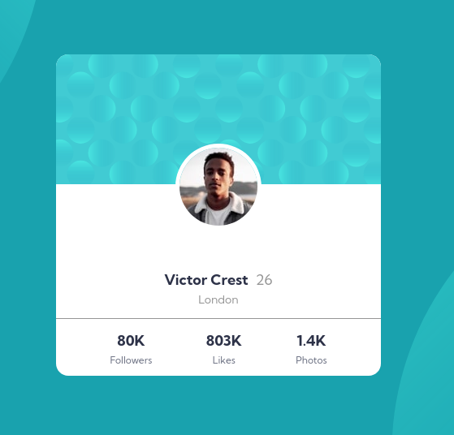

# Frontend Mentor - Profile card component


## Table of contents

- [Overview](#overview)
  - [The challenge](#the-challenge)
  - [Screenshot](#screenshot)
  - [Links](#links)
- [My process](#my-process)
  - [Built with](#built-with)
  - [What I learned](#what-i-learned)
  - [Continued development](#continued-development)
  - [Useful resources](#useful-resources)
- [Author](#author)
- [Acknowledgments](#acknowledgments)

## Overview

### Screenshot




### Links

- Solution URL: [Source Code](https://github.com/AlexdelCarmen/profile-card-component)
- Live Site URL: [Live Page](https://alexdelcarmen.github.io/profile-card-component/)

## My process

I structured the HTML first, with a mobile layout first mindset, then styled it for mobile screens, and lastly, added a media query to handle desktop displays.

### Built with

- Semantic HTML5 markup
- CSS custom properties
- Flexbox
- Mobile-first workflow


### What I learned

I managed to kind of get the background pattern, this was quite the challenge.  

```css
body {
  padding: 0;
  margin: 0;
  font-family: "Kumbh Sans";
  background-color: var(--dark-color-1);
  background-image: url("./images/bg-pattern-top.svg"),
    url("./images/bg-pattern-bottom.svg");
  background-position: top -70% right 200px, bottom -70% left 200px;
  background-repeat: no-repeat;
  background-attachment: fixed;
  background-size: contain;
}


```

### Continued development

I got to get better at creating background patterns out of separate images. .

### Useful resources

- [W3Schools](https://www.w3schools.com/) - background image manipulation.

## Author

- Website - [Github Profile](https://github.com/AlexdelCarmen)
- Frontend Mentor - [@AlexdelCarmen](https://www.frontendmentor.io/profile/AlexdelCarmen)
- Twitter - [@AlekBorchov](https://twitter.com/AlekBorchov)

## Acknowledgments

To mom.
